# soft-roce
Using the [following](https://enterprise-support.nvidia.com/s/article/howto-configure-soft-roce) NVIDIA article on deploying Soft-RoCE on Ethernet-connected infrastructure. This repository and README.md contains the steps that I have followed and used to get the software implementation of RDMA transport working on CSC (i.e., Finnish state IT and computing infrastruture) infrastructure.

The NVIDIA article has some errors/instructions which do not work and have been changed in this documentation.

To get Soft-RoCE running you need to configure and install,
1. A Linux kernel with "Software RDMA over Ethernet" support
2. User space libraries which support Soft-RoCE itself

## Installation
As described in the NVIDIA document, both kernel and user space libraries are needed on both servers.

In terms of servers that I am using/have used, the following table contains the tested CSC virtual machine flavours and whether they worked or not.

| Flavour | Cores |  Memory (GB) | Notes |
|---|---|---|---|
| standard.tiny | 1 | 1 | [Unsuccesful] Kernel cloning from repository takes too long |
| standard.small | 2 | 3 | [Unsuccesful] Kernel cloning from repository takes too long |
| standard.medium | 3 | 4 | [Unsuccesful] Kernel and user space libaries are able to be built, but kernel compilation takes a **long** time. However, once restarting, there is not enough memory to start |
| standard.large | 4 | 8 | [Succesful] Kernel and user space libaries are able to be built, but note that kernel compilation takes a **long** time |

For each of the virtual machines, I chose to use Ubuntu 22.04 as the base image/operating system.

### Kernel installation
1. The kernel should be cloned. The NVIDIA instructions say to clone version 4.9.0 of the kernel but from testing, the latest version of the Linux kernel appears to have the appropriate support. As of writing this documentation (2024-02-19 10:50), the cloned version of the kernel was Linux 6.8-rc5.

Move into `/usr/src/`.

```sh
cd /usr/src
```

Clone the Linux kernel - `sudo` permissions may or may not be needed.

```sh
sudo git clone git://git.kernel.org/pub/scm/linux/kernel/git/stable/linux-stable.git linux
```

2. Compiling the cloned Linux kernel requires some configuration.

```sh
cd linux
sudo cp /boot/config-$(uname -r)* .config
```

Before configuring the kernel, there are some packages which need to be installed before running the `make` command.

```sh
sudo apt-get install make gcc libncurses-dev flex bison
```

Once these are installed, now the kernel can be compiled.

```sh
sudo make menuconfig
```

This window will open:

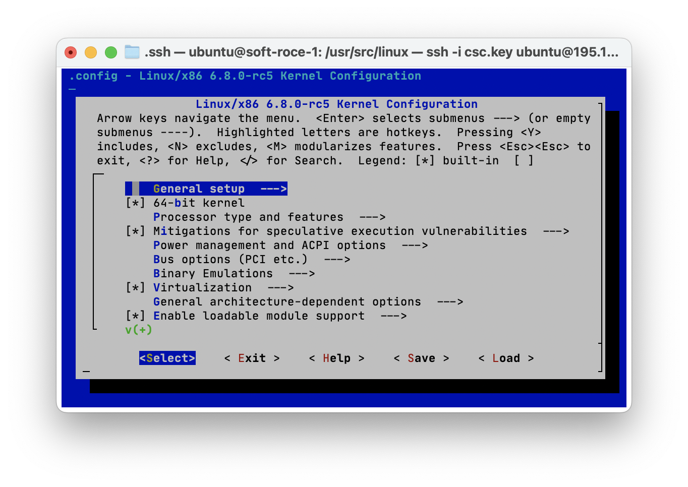

3. To enable Soft-RoCE, the following needs to be done.
    1. Press the `/` key and a search field will be opened.
    2. Type `rxe` and hit the `Enter` key, i.e., selecting the highlighted `<  Ok  >`.
    3. Press the `1` key to go to the "Software RDMA over Ethernet (RoCE) driver".
    4. You should see that it is selected as it is specified as `<M>`. If not, press the `Space` key until you see `<M>` and **not** `< >`.
    5. Using the right arrow key, move to the option `< Save >` and press the `Enter` key.
    6. The filename should be left as `.config` and the `Enter` key can be pressed to select `<  Ok  >`.
    7. The `Enter` key can be pressed again to select `< Exit >`.
    8. Using the right arrow key, select `< Exit >` and press the `Enter` key until the wizard is exited. This might require you to re-selected `< Exit >`, so do not spam the `Enter` key all at once.

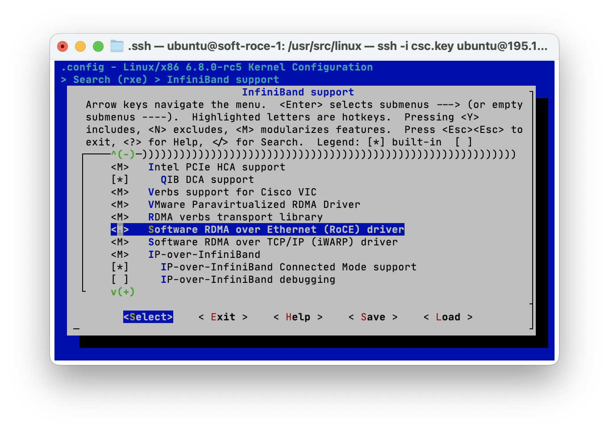

4. With the kernel configured, steps can be taken towards compiling it.

There are some additional libraries which need to be installed.

```sh
sudo apt-get install libelf-dev libssl-dev
```

To prevent the following make error during compilation, several steps need to be taken.

```sh
make[3]: *** No rule to make target 'debian/canonical-certs.pem', needed by 'certs/x509_certificate_list'.  Stop.
```

These steps are from [here](https://stackoverflow.com/questions/67670169/compiling-kernel-gives-error-no-rule-to-make-target-debian-certs-debian-uefi-ce).

```sh
sudo mkdir -p /usr/local/src/debian
sudo apt-get install linux-source
sudo cp -v /usr/src/linux-source-*/debian/canonical-*.pem /usr/local/src/debian/
sudo apt-get purge linux-source*
```

Then, the `.config` file needs to be updated so the certificate paths for signature checking are correct.
```sh
sudo vim .config
```

The first variable to change is `CONFIG_SYSTEM_TRUSTED_KEYS`, from,
```conf
CONFIG_SYSTEM_TRUSTED_KEYS="debian/canonical-certs.pem"
```

to,
```conf
CONFIG_SYSTEM_TRUSTED_KEYS="/usr/local/src/debian/canonical-certs.pem"
```

Then, the second variable to change is `CONFIG_SYSTEM_REVOCATION_KEYS`, from,
```conf
CONFIG_SYSTEM_REVOCATION_KEYS="debian/canonical-revoked-certs.pem"
```

to
```conf
CONFIG_SYSTEM_REVOCATION_KEYS="/usr/local/src/debian/canonical-revoked-certs.pem"
```

5. Now the kernel can be compiled.

Using `nproc` check how many processing units are available for the compilation, e.g., `4`. Then the kernel can be compiled. NB: replace 4 in the following commands with whatever output `nproc` gives.

```sh
sudo make -j 4
```

Depending on the number of available procesing units, this compilation may take a while, e.g., 3 to 4 hours.

Install the modules.

```sh
sudo make -j 4 modules_install
```

Install the kernel.

```sh
sudo make -j 4 install
```

6. Reboot the server and login again.

```sh
sudo shutdown -r now
```

7. Check that the new kernel and the rdma_rxe module were installed.

```sh
uname -r
```

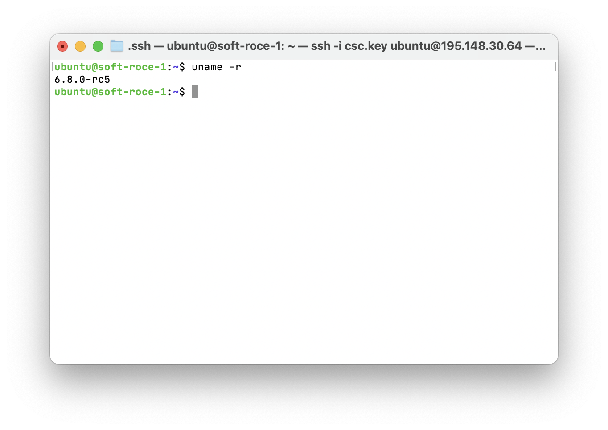

```sh
modinfo rdma_rxe
```

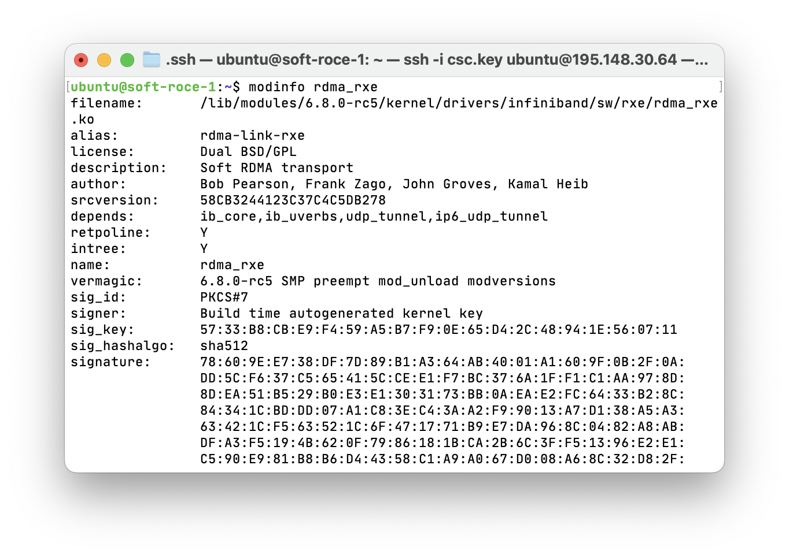

If it looks similar then the kernel and module were correctly configured.

## User space libraries installation

According to the NVIDIA article, the user space libraries which support Soft-RoCE have not been distributed and requires installation. The article provides instructions for manual building and installation from the [rdma-core repository](https://github.com/linux-rdma/rdma-core). However, there appears to be a pre-compiled version available through `apt-get`.

1. Install some pre-requisites.

```sh
sudo apt-get install build-essential cmake gcc libudev-dev libnl-3-dev libnl-route-3-dev ninja-build pkg-config valgrind python3-dev cython3 python3-docutils pandoc
```

2. Install `rdma-core`.

```sh
sudo apt-get install rdma-core
```

## Usage and testing
Software RDMA should now be made available on an existing (Ethernet) interface using one of the available drivers.

1. Check which interfaces are available and especially the name of the interface.

```sh
ip link
```

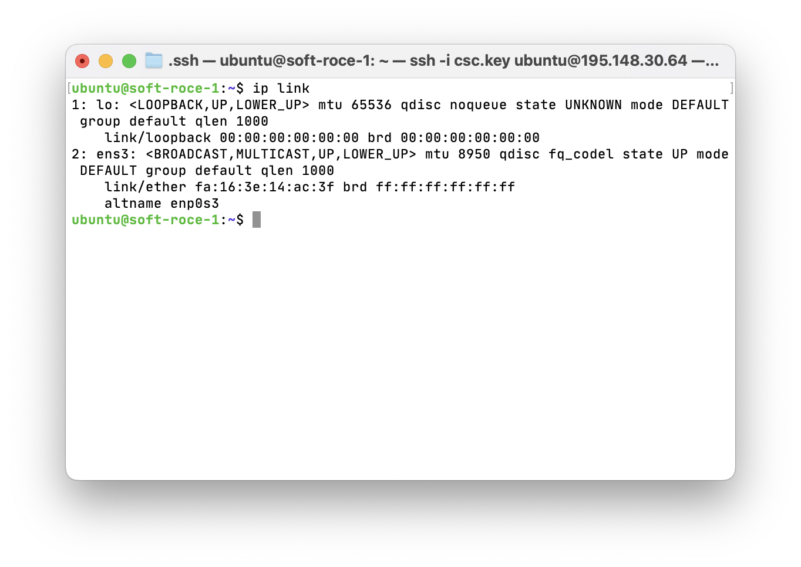

In my example, the Ethernet interface is called `ens3`.

2. Now an RXE device should be created over the network interfae, e.g., `ens3`.

```sh
sudo rdma link add rxe_ens3 type rxe netdev ens3
```

Where `rxe_ens3` is the *name* of the device, `rxe` is the type of the driver, and `ens3` is the network interfacce in question.

3. The link command provides no output so the status command can be called to display the current configuration.

```sh
rdma link
```

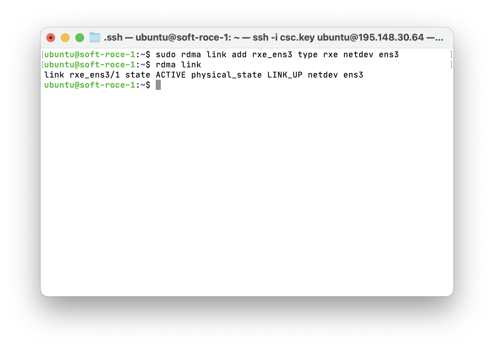

Alternatively, `ibv_devices` can be used to verify the device was created succesfully but this requires some tools to be installed.

```sh
sudo apt-get install ibverbs-utils
```

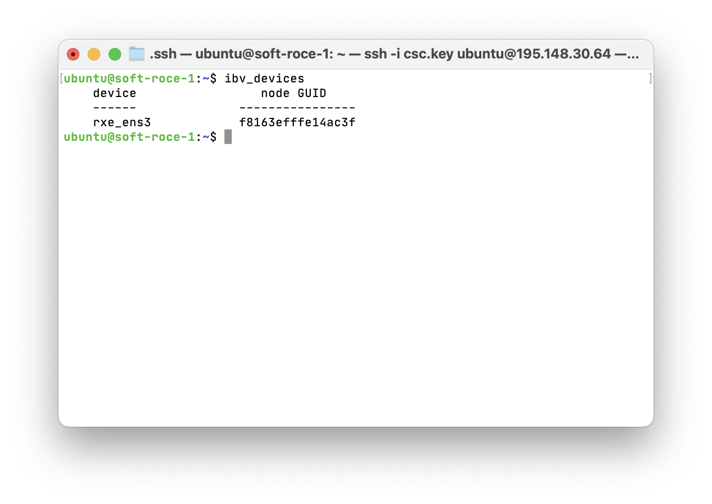

---

Now, this installation should be replicated on one (or more) servers/virtual machines which are connected by Ethernet. This can be done through following the instructions again, or by creating a snapshot of the server and deploying that.

With another instance created, the connection between both servers can be tested. Some tools are needed for that.

### InfiniBand Testing
First of all, we will test using InfiniBand. The following commands are to be run on both/all servers unless specified otherwise.

```sh
sudo apt-get install perftest
```

The IPs of the machines are needed, so we need `net-tools`.

```sh
sudo apt-get install net-tools
```

`ifconfig` can be run on both servers to obtain their IPs.

```
server_1: 192.168.1.8
server_2: 192.168.1.14
```

Now, `server_1` is chosen to act as the main "server" for the bandwidth test, so, run:

```sh
ib_send_bw
```

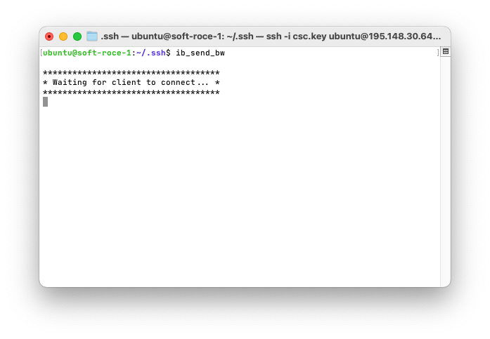

Then, `server_2` will act as the "client". The same InfiniBand command will be executed, but with the parameter of `server_1`, i.e., `192.168.1.8`.

```sh
ib_send_bw 192.168.1.8
```

`server_2` will then connect to `server_1` using the created `rxe` interface, and with this InfiniBand command, will perform a bandwidth test. The following images correspond to `server_1` and `server_2`, respectively.

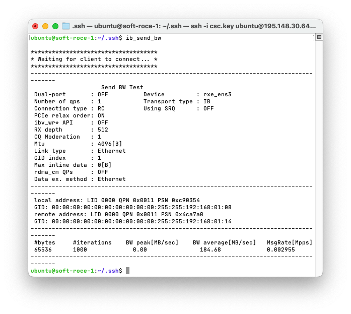

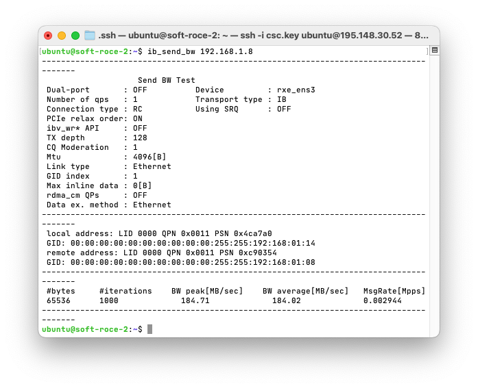

We can see several things using this tool:
1. The MTU sending size of the link connection.
2. That the `Link` is indeed Ethernet.
3. And the statistics of the bandwidth test performed, e.g., peak, average, and message rates.

Another InfiBand tool is `ibv_rc_pingpong` which can be used to perform ping/similar bandwidth measurements as the above `ib_send_bw` tool.

On `server_1` or the "server", run the following command, specifying the name of the `rxe` device/interface, and the parameter `-g`. This latter parameter refers to the "GID", and should be accessible through a [script](https://enterprise-support.nvidia.com/s/article/understanding-show-gids-script). However, that is not available so I used trial and error instead, i.e., starting from `-g 0` and then to `-g 1`.

```sh
ibv_rc_pingpong -d rxe_ens3 -g 1
```

`server_2` should again have a similar command where the GID parameter is also specified, as well as the address of `server_1`.

```sh
ibv_rc_pingpong -d rxe_ens3 -g 1 192.168.1.8
```

The following images correspond to the ping test working on `server_1` and `server_2`, respectively.

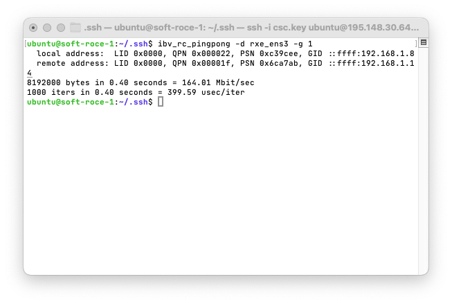

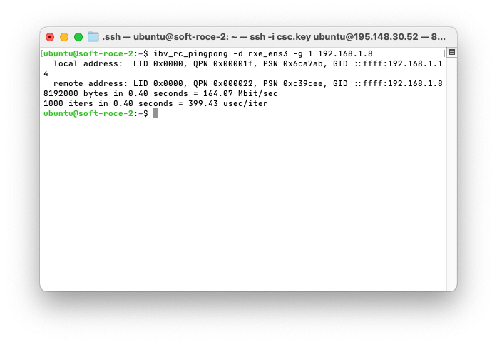

### rping testing
Another tool is `rping` which can be used to perform ping-like tests over RDMA.

```sh
sudo apt install rdmacm-utils
```

Then on `server_1` which will act as the "server", provide the `rping` command with parameters specifying that it will act as a server and also its own address.

```sh
rping -s -a 192.168.1.8
```

On `server_2` a similar command is run with changes as it will act as a "client" and 10 ping messages will be sent.

```sh
rping -c -a 192.168.1.8 -C 10 -v
```

The following images correspond to `server_1` and `server_2`, respectively.

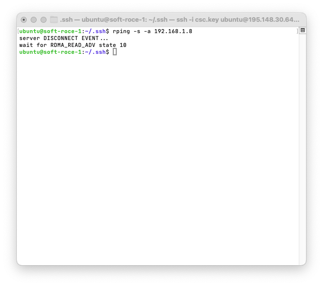

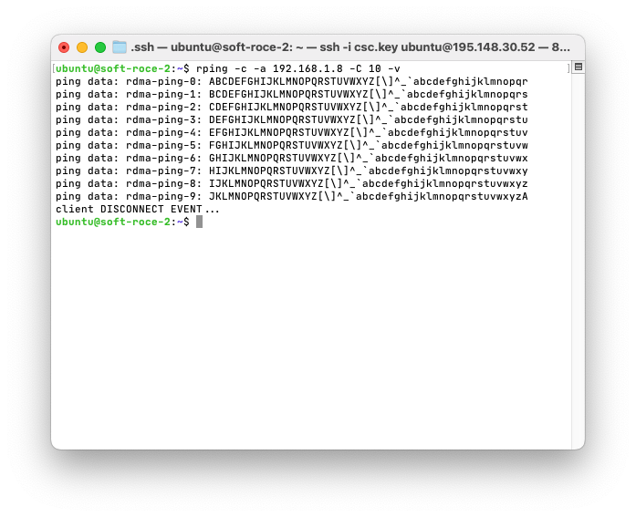

### qperf testing
Another tool is `qperf` and is used to test bandwidth and other metrics.

```sh
sudo apt install qperf
```

On `server_1`, `qperf` can be run simply by itself without any parameters.

```sh
qperf
```

Then on `server_2`, a few more parameters are added, such as enabling RDMA connection manager, specfying the server address, and for a bandwidth test. This latter parameter can be changed according to the type of test wanted, other tests can be checked using `qperf --help examples`.

```sh
qperf -cm 1 192.168.1.8 rc_bw
```

The following images are of `server_1` and `server_2`, respectively.

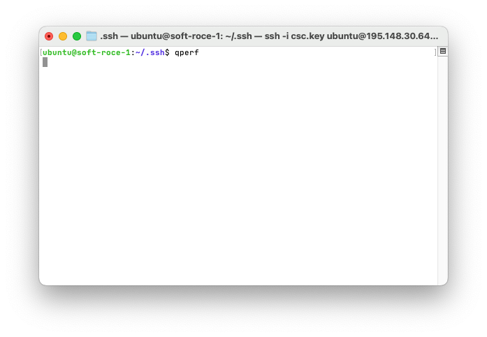

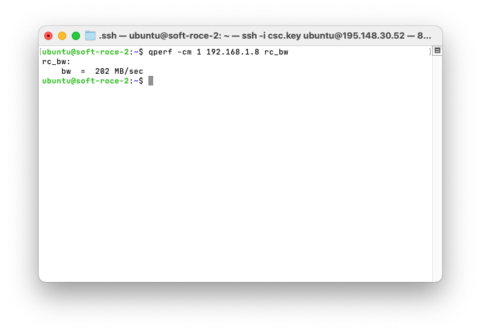
